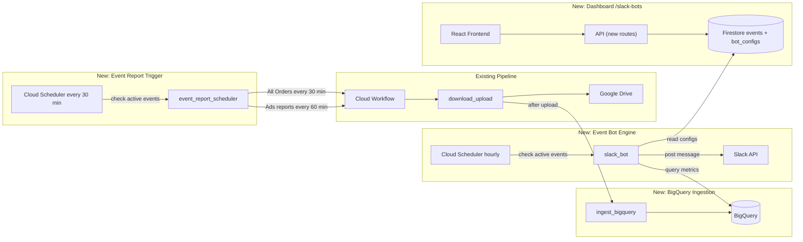

# Slack Bots -- Phase 1a: Hourly Event Bot

## Scope

Worker priority: **Hourly > Event Wrap-Up > Daily**. Phase 1a delivers the **Hourly Event Bot** -- during Amazon sales events (Prime Day, Black Friday, etc.), post cumulative day-to-date metrics to each client's Slack channel every hour.

**What Phase 1a includes:**
- BigQuery data warehouse (orders table + 3 ads tables)
- Generic TSV ingestion after report download (all workflows, graceful skip for unregistered types)
- Event management (Firestore config, managed via dashboard)
- Hourly Event Bot with per-marketplace breakdown in local currency
- Total row for single-currency clients (multi-currency Total deferred to Step 12)
- Slack app + channel delivery
- Dedicated `/slack-bots` top-level dashboard page (bot config + event management + Go Live control)
- Event-aware scheduling (hourly report pulls only during active events, no-op otherwise)

**What Phase 1b adds later:** Daily Pulse Bot, Event Wrap-Up / Day Recap with YoY comparison, testing tools, message preview, Marketing Stream upgrade, remaining BigQuery tables.

---

## Scale and Rate Limits

- ~40 clients, ~60 client-marketplace pairs
- Rate limits are **per-seller** (not per-developer) -- 40 independent buckets, no interference
- During a 2-day event at peak: 60 pairs x 48 pulls x 2 report types = ~5,760 workflow executions (within capacity)
- Slack messages: ~40 per hour during events (one per client, all marketplaces in one message)

**Amazon API rate limits (relevant):**
- `createReport`: 1 request per 60 sec per seller (burst 15) -- ~1,440 requests/day per seller
- **All Orders report has NO refresh restriction** -- can be pulled every 15-30 min (unlike daily reports which have a 4-hour refresh limit)
- Ads API v3: dynamic throttling, stagger requests across sellers
- Per-seller buckets mean we can parallelize across all 40 clients simultaneously

---

## Architecture



---

## Data Source Strategy

**Key insight**: `GET_FLAT_FILE_ALL_ORDERS_DATA_BY_LAST_UPDATE_GENERAL` has **no refresh restriction** (unlike most SP API reports which are limited to once per 4 hours). This gives us near real-time Total Sales through the existing pipeline.

**Sales data (~30 min freshness):**
- Report: `GET_FLAT_FILE_ALL_ORDERS_DATA_BY_LAST_UPDATE_GENERAL` pulled every 30 minutes during events
- Contains individual order line items with `item-price`, `currency`, `order-status`
- Aggregate in BigQuery: `SUM(item_price) WHERE order_status != 'Cancelled'` grouped by marketplace
- No new API integration needed -- uses existing report pipeline

**Ads data (~1-2 hour freshness, Amazon-side lag):**
- Reports: `spCampaigns`, `sbCampaigns`, `sdCampaigns` with `today` date, pulled hourly
- Amazon caches ad data for 1-2 hours internally -- this lag exists regardless of how often we pull
- Aggregate in BigQuery: `SUM(cost)` for Spend, `SUM(sales7d)` for PPC Sales

**Computed metrics:**
- ACoS = Spend / PPC Sales
- TACoS = Spend / Total Sales
- Units = from orders `SUM(quantity)`

**Upgrade path (if 1-2h ad lag is unacceptable):**
- Amazon Marketing Stream (AWS SQS) -- push-based, natively hourly ad data, ~$50-100/mo AWS cost
- Single SQS queue serves all 40+ accounts (data includes `profileId` for routing)
- Bridge: AWS Lambda -> GCP Pub/Sub -> Cloud Function -> BigQuery
- The bot logic and BigQuery schema stay the same -- only the ingestion layer changes

**Optimization to add**: Subscribe to `REPORT_PROCESSING_FINISHED` notifications via SP-API Notifications API. Instead of polling report status, Amazon pushes a webhook when the report is ready. Saves GET calls and speeds up the pipeline.

---

## Step 1: BigQuery Infrastructure (Pulumi) ✅

> **Deployed to staging 2026-05-07.** Dataset `kalilos_reports_staging` live with all 4 tables.

**New file**: [`infra/resources/bigquery.py`](infra/resources/bigquery.py)

- Dataset: `kalilos_reports_{env}`
- Enable BigQuery API in [`infra/resources/apis.py`](infra/resources/apis.py)
- 4 tables, all partitioned by `report_date`, clustered by `client_id, marketplace`:

| Table | Source Report | Key Columns |
|---|---|---|
| `orders` | `GET_FLAT_FILE_ALL_ORDERS_DATA_BY_LAST_UPDATE_GENERAL` | `amazon_order_id`, `purchase_date`, `order_status`, `quantity`, `currency`, `item_price`, `shipping_price`, `item_tax`, `sku`, `asin` |
| `sp_campaigns` | `spCampaigns` | `cost`, `impressions`, `clicks`, `sales7d`, `purchases7d`, `campaignName`, `campaignId` |
| `sb_campaigns` | `sbCampaigns` | `cost`, `impressions`, `clicks`, `sales`, `purchases`, `newToBrandSales`, `campaignName` |
| `sd_campaigns` | `sdCampaigns` | `cost`, `impressions`, `clicks`, `sales`, `purchases`, `newToBrandSales`, `campaignName` |

(`exchange_rates` table added later in Step 12 when multi-currency Total row is needed)

Common metadata on every report table: `client_id STRING`, `marketplace STRING`, `report_date DATE`, `ingested_at TIMESTAMP`, `job_id STRING`.

- IAM: functions SA gets `roles/bigquery.dataEditor` + `roles/bigquery.jobUser`
- Wire into [`infra/__main__.py`](infra/__main__.py) after foundation resources

**Schema registry**: [`functions/shared/bq_schemas.py`](functions/shared/bq_schemas.py) -- maps `(report_type, api_source)` to BigQuery table name + column schema. Uses `ColumnMapping` dataclass with `(bq_name, bq_type, tsv_header)` for TSV→BQ column mapping. `TableSchema` includes optional `dedup_key` tuple (orders use MERGE, ads use replace). `cast_value()` helper handles type conversion. Designed to be extended as more report types are added to BigQuery in Phase 1b+.

---

## Step 2: BigQuery Ingestion Function ✅

> **Deployed to staging 2026-05-07.** E2E tested: 2,487 order rows + 66 sp_campaigns rows loaded for Betallic/US.

**New**: `functions/ingest_bigquery/main.py` (512Mi, 300s timeout, max 10 instances)

- Receives: `report_type`, `api_source`, `client_id`, `marketplace`, `report_date`, `job_id`, `gdrive_file_id`
- Downloads report file from Drive using `gdrive_file_id` (reuses `drive_client`). Handles both native files and Google Sheets exports (auto-converts Sheets to TSV via export)
- Looks up schema from `bq_schemas.py`; if report type not registered, returns 200 (graceful skip -- not all report types need BQ ingestion yet)
- Parses TSV with `csv.DictReader`, maps TSV headers to BQ column names via `ColumnMapping`, casts to schema types (STRING/FLOAT/INTEGER/DATE/BOOLEAN/TIMESTAMP)
- Deduplication strategy: for orders, MERGE on `(amazon_order_id, sku)` via a staging table; for ads, DELETE + INSERT for same `(client_id, marketplace, report_date)` with latest pull
- `bigquery.Client(project=GCP_PROJECT)` -- explicit project required to avoid project ID inference issues

**Pulumi**: Added to `FUNCTION_DEFS` in [`infra/resources/functions.py`](infra/resources/functions.py) with `BQ_DATASET` env var; workflow SA invoker rights in [`infra/resources/iam.py`](infra/resources/iam.py).

**Bugs found during e2e testing (fixed):**
1. BQ client was not using explicit `GCP_PROJECT` env var — caused project ID resolution failure
2. Staging table name construction used `replace("-", "_")` on the full table ref, corrupting the project ID `kalilos-connector-staging` → `kalilos_connector_staging`. Fixed by only sanitizing the suffix

---

## Step 3: Wire Ingestion into Workflow ✅

> **Deployed to staging 2026-05-07.** Completed as part of Step 2 deployment.

**Edit**: [`workflows/report_flow.yaml`](workflows/report_flow.yaml)

Added best-effort `ingest_bigquery` step after `download_upload`, wrapped in try/except — ingestion failure is logged as WARNING but the workflow still succeeds (report is safe in Drive). Passes `api_source`, `client_id`, `marketplace`, `report_type`, `report_date`, `job_id`, and `gdrive_file_id` from the download step result.

**Edit**: [`infra/resources/workflow.py`](infra/resources/workflow.py) -- added `__INGEST_BIGQUERY_FUNCTION_URL__` placeholder replacement using `cloud_functions["ingest-bigquery"].url`.

**Edit**: [`functions/shared/workflow_launcher.py`](functions/shared/workflow_launcher.py) -- added `report_date` parameter to `build_payload()` and threaded it through `launch_for_marketplace()` so the workflow can pass it to the ingest step.

**Edit**: [`functions/api/main.py`](functions/api/main.py) -- added `report_date` to `build_payload()` calls in both the on-demand trigger and retry paths.

---

## Step 4: Slack App Setup + Client Module ✅

> **Code complete 2026-05-07.** `slack_client.py` created. Slack app creation + token storage is a manual step to be done before Step 11 testing.

**Manual steps** (to be done before Step 11):
1. Create Slack App at api.slack.com -- Bot Token Scopes: `chat:write`, `channels:read`
2. Install to the workspace, get Bot User OAuth Token (`xoxb-...`)
3. Store: `make secret-set NAME=kalilos-{env}-slack-bot-token VALUE=xoxb-...`

**New**: [`functions/shared/slack_client.py`](functions/shared/slack_client.py)
- Token from Secret Manager (`kalilos-{env}-slack-bot-token`), lazy-loaded and cached for process lifetime (same pattern as SP/Ads credentials)
- `post_message(channel_id, blocks, text_fallback, thread_ts)` -- `chat.postMessage` via `requests` (no Slack SDK dependency), supports threading
- `format_currency(amount, currency_code)` -- locale-aware: `$1,720.88`, `CA$319.07`, `£6.03`, `€2.16` — uses Decimal for precision
- `format_percentage(value)` -- `27.56%`
- `format_delta(current, previous)` -- `[+14%]` or `[-39%]` or `[new]`
- `format_delta_bps(current_pct, previous_pct)` -- `[+37 bps]` for percentage-point changes (ACoS, TACoS)
- `MARKETPLACE_CURRENCIES` -- mapping for all 14 marketplaces (US→USD, CA→CAD, UK→GBP, DE/FR/IT/ES/NL→EUR, etc.)

---

## Step 5: Event + Bot Config Data Model (Firestore) ✅

> **Deployed to staging 2026-05-07.** Firestore CRUD for `events`, `bot_configs`, `bot_activity` in `firestore_utils.py`. API routes for events CRUD, activation/deactivation, bot config CRUD in `api/main.py`. 42 tests passing.

**New collection: `events`** (managed via the `/slack-bots` dashboard):
```python
{
    "name": "Prime Day 2026",
    "start_date": "2026-07-13",           # inclusive, auto-activate
    "end_date": "2026-07-14",             # inclusive, auto-deactivate
    "prior_event_id": "prime_day_2025",   # for YoY comparison (Phase 1b)
    "status": "upcoming",                 # upcoming | live | completed
    "manually_activated": False,          # True if "Go Live" was clicked before start_date
    "activated_at": None,                 # when the event actually went live
    "created_at": "...",
}
```

The `event_report_scheduler` function checks: is there any event with `status == "live"`? Events transition automatically (`upcoming -> live` on start_date, `live -> completed` on end_date + 1), or manually via the "Go Live" / "End Event" buttons.

**New collection: `bot_configs`** (one doc per client):
```python
{
    "client_id": "acme",
    "slack_channel_id": "C07XXXXXX",
    "slack_channel_name": "#acme-reports",
    "base_currency": "USD",              # for Total row conversion
    "client_timezone": "America/Los_Angeles",  # display time in client's tz
    "marketplaces": ["US", "CA", "UK", "DE", "ES", "IT", "FR", "NL"],
    "hourly_bot": {
        "enabled": True,                 # fires during active events only
    },
    # Phase 1b:
    # "daily_bot": { "enabled": True, "send_time": "09:00", "comparisons": [...] },
    # "event_wrapup_bot": { "enabled": True },
    "test_channel_id": "",
    "use_test_channel": False,
}
```

**API routes** (add to [`functions/api/main.py`](functions/api/main.py)):
- `GET/POST /events`, `GET/PUT/DELETE /events/<event_id>` -- event CRUD
- `GET/PUT /bot-configs/<client_id>` -- bot config CRUD
- `GET /bot-configs` -- list all

**Firestore utils**: Add CRUD for both collections to [`functions/shared/firestore_utils.py`](functions/shared/firestore_utils.py).

---

## Step 6: Event Report Scheduler Function ✅

> **Deployed to staging 2026-05-07.** `functions/event_report_scheduler/main.py` — auto-transitions events, launches orders every 30 min + ads every 60 min during live events. 0.5s stagger. Cloud Scheduler `kalilos-{env}-event-report-scheduler` at `*/30 * * * *`.

**New**: `functions/event_report_scheduler/main.py`

Triggered every 30 minutes by Cloud Scheduler. Only does work during active events:

1. Auto-transition events: query all events, transition `upcoming -> live` if `start_date <= today`, transition `live -> completed` if `end_date < today`
2. Check if any event has `status == "live"` -- if none, return immediately (no-op -- costs nothing)
3. For each `bot_config` with `hourly_bot.enabled`:
   - For each marketplace in the config:
     - **Every 30 min**: Launch workflow for `GET_FLAT_FILE_ALL_ORDERS_DATA_BY_LAST_UPDATE_GENERAL` with `today` timeframe (no refresh limit on this report)
     - **Every 60 min** (on the hour only): Launch workflows for `spCampaigns`, `sbCampaigns`, `sdCampaigns` with `today` timeframe
   - Use existing `build_payload()` + `launch_execution()` from [`functions/shared/workflow_launcher.py`](functions/shared/workflow_launcher.py)
4. Stagger requests across sellers by a few seconds to avoid thundering herd on Amazon's side

**Report volume during events:** ~60 marketplace pairs x 1 order report every 30 min + 3 ads reports every 60 min = ~300 workflow executions per hour (well within capacity).

---

## Step 7: Hourly Event Bot Function ✅

> **Deployed to staging 2026-05-07.** `functions/slack_bot/main.py` — queries BQ for orders + ads metrics, formats Block Kit message per marketplace with local currency, Total row for single-currency clients. Tested against real BQ data (Betallic/US: $28K sales, $300 spend). Cloud Scheduler `kalilos-{env}-hourly-bot` at `45 * * * *`.

**New**: `functions/slack_bot/main.py`

**Trigger**: Cloud Scheduler `kalilos-{env}-hourly-bot`, cron `45 * * * *` (45 min past each hour -- gives ad reports time to complete after the :00 trigger; order data is already fresher from the :30 pull).

**Logic**:
1. Check for active event -- if none, return immediately
2. Load all `bot_configs` with `hourly_bot.enabled`
3. For each client config:
   a. Get client timezone, format current hour display (e.g., "6 PM PST")
   b. Determine event day index (e.g., "Day 1" or "Day 2")
   c. For each marketplace:
      - Query BigQuery `orders` table: `SUM(item_price) WHERE report_date = today AND order_status != 'Cancelled'` -> Total Sales, Units
      - Query BigQuery `sp/sb/sd_campaigns`: `SUM(cost)` -> Spend, `SUM(sales)` -> PPC Sales
      - Compute: ACoS (Spend / PPC Sales), TACoS (Spend / Total Sales)
      - Format amounts in marketplace native currency (`$`, `CA$`, `£`, `€`)
      - Show marketplace local time if different from client timezone (e.g., "UK (2 AM GMT)")
   c. **Total row**: For single-currency clients (e.g., US-only), show a simple sum. For multi-currency clients, show per-marketplace only (no converted Total row yet -- added in Step 12 with exchange rates)
   d. Format Slack Block Kit message (Step 8)
   e. Post to `slack_channel_id` (or `test_channel_id` if `use_test_channel`)
4. Log activity to Firestore `bot_activity` collection (timestamp, client_id, status, message_ts)

---

## Step 8: Slack Message Template ✅

> **Implemented as part of Step 7.** Block Kit `section` blocks with `mrkdwn`. Metrics order: Spend, PPC Sales, ACoS, Total Sales, TACoS. Per-marketplace local currency formatting. Total row for single-currency clients.

Matching the actual format from last year's events:

```
:zap: *Hourly Update -- Acme*
6 PM PST | Prime Day 2026 -- Day 1

*US*
Spend: $1,720.88
PPC Sales: $6,244.40
ACoS: 27.56%
Total Sales: $39,650.42
TACoS: 4.34%

*CA*
Spend: CA$319.07
PPC Sales: CA$1,446.89
ACoS: 22.05%
Total Sales: CA$2,662.71
TACoS: 11.98%

*UK* (2 AM GMT)
Spend: £6.03
PPC Sales: £213.32
ACoS: 2.83%
Total Sales: £255.98
TACoS: 2.36%

*DE*
Spend: €0.00
PPC Sales: €0.00
ACoS: 0.00%
Total Sales: €29.99
TACoS: 0.00%

... (remaining marketplaces)

*Total*
Spend: $1,959.69
PPC Sales: $7,946.04
ACoS: 24.66%
Total Sales: $41,921.53
TACoS: 4.67%
```

Slack Block Kit `section` blocks with `mrkdwn`. All marketplaces shown (including zeros -- consistent with the original format). Metrics order: Spend, PPC Sales, ACoS, Total Sales, TACoS.

---

## Step 9: Cloud Scheduler Jobs ✅

> **Deployed to staging 2026-05-07.** Two new scheduler jobs added to `infra/resources/scheduler.py`. Both OIDC-authenticated via scheduler SA. New functions + IAM bindings in `functions.py` and `iam.py`.

Add to [`infra/resources/scheduler.py`](infra/resources/scheduler.py):

| Job | Cron | Target | Purpose |
|-----|------|--------|---------|
| `kalilos-{env}-event-report-scheduler` | `*/30 * * * *` | `event_report_scheduler` fn | Trigger report pulls during active events (no-ops otherwise) |
| `kalilos-{env}-hourly-bot` | `45 * * * *` | `slack_bot` fn | Post Slack messages during active events (no-ops otherwise) |

Both use OIDC auth with the scheduler SA (same pattern as existing `kalilos-{env}-scheduler`).

Cost when no event is active: effectively zero (~8,760 no-op invocations/year per job, pennies in Cloud Function invocation costs).

---

## Step 10: Frontend -- `/slack-bots` Page ✅

> **Deployed to staging 2026-05-07.** Types (`Event`, `BotConfig`), API methods, hooks (`use-events.ts`, `use-bot-configs.ts`), nav item, route, and full page with active event banner, events CRUD table, client bot config table with edit dialogs. Go Live / End Event workflow.

**New top-level page**: [`frontend/src/pages/slack-bots.tsx`](frontend/src/pages/slack-bots.tsx)

This is a purpose-built feature, not a scheduler configuration. Workers never see report types, cron expressions, or timeframe strategies. They see clients, Slack channels, and a "Go Live" button.

### Page Layout

**Top banner: Active Event Status**
- When an event is live: prominent green banner showing event name, day index ("Day 1 of 2"), time running, and an **"End Event"** button
- When no event is live: neutral banner with **"Go Live"** button that opens the event activation dialog (pick existing event or create new)
- This is the primary control -- one click to start, one click to stop

**Section 1: Events**
- Card with a table of events: name, dates, status badge (upcoming / live / completed), edit/delete actions
- "Create Event" button -> simple dialog: event name + start date + end date (that's it -- no report config, no cron, no timeframe)
- Events auto-activate on their start date and auto-deactivate on their end date
- Manual override: "Go Live" / "End Event" buttons for immediate control (e.g., event starts early, or needs to be stopped)

**Section 2: Client Bot Configuration**
- Table of all clients showing:
  - Client name
  - Slack channel (with link icon)
  - Marketplaces (badge list)
  - Enabled/disabled toggle (inline)
  - Base currency
  - Test mode indicator
- Row click -> edit dialog:
  - Slack channel ID + channel name
  - Base currency selector (USD, CAD, GBP, EUR, AUD, etc.)
  - Client timezone selector (for display time in messages)
  - Marketplace checkboxes (which to include in the hourly update)
  - Hourly bot enabled toggle
  - Test mode: toggle + test channel ID (sends to test channel instead of live)
- "Configure All" bulk action for initial setup (set channel for multiple clients at once)

### Key UX principle

The system is fully self-contained. Once clients are configured, the only action needed per event is clicking "Go Live." The platform knows:
- Which reports to pull (All Orders every 30 min, Ads campaigns hourly)
- For which clients (all with `hourly_bot.enabled`)
- For which marketplaces (from each client's bot config)
- Where to post (each client's Slack channel)
- How to format (per-marketplace local currency + Total in base currency)

No manual schedule creation. No report type selection. No frequency configuration.

**Routing**: Add `/slack-bots` route in [`frontend/src/App.tsx`](frontend/src/App.tsx), "Slack Bots" nav item in [`frontend/src/components/layout.tsx`](frontend/src/components/layout.tsx).

**Types**: Add `BotConfig` and `Event` interfaces to [`frontend/src/types/index.ts`](frontend/src/types/index.ts).

**API + hooks**: `botConfigs` + `events` methods in [`frontend/src/lib/api.ts`](frontend/src/lib/api.ts), new [`frontend/src/hooks/use-bot-configs.ts`](frontend/src/hooks/use-bot-configs.ts) and [`frontend/src/hooks/use-events.ts`](frontend/src/hooks/use-events.ts).

---

## Step 11: Deploy and Verify

1. `make env-staging && make preview`
2. `make deploy-all`
3. Store Slack bot token: `make secret-set NAME=kalilos-staging-slack-bot-token VALUE=xoxb-...`
4. Create a test event in the dashboard (today's date range)
5. Create bot configs for a test client via the dashboard
6. Trigger an existing report schedule to verify BigQuery ingestion works
7. Manually invoke `slack_bot` function to verify Slack message formatting and delivery
8. Let the event report scheduler run for one cycle, verify full end-to-end flow
9. `make health`

---

## Files Changed / Created

| Status | Action | Path | What |
|--------|--------|------|------|
| ✅ | **Create** | `infra/resources/bigquery.py` | BQ dataset + 4 tables (orders, 3 ads) |
| ✅ | **Edit** | `infra/__main__.py` | Import + wire bigquery module (step 3b) |
| ✅ | **Edit** | `infra/resources/apis.py` | Enable BigQuery API |
| ✅ | **Edit** | `infra/resources/iam.py` | BQ roles for functions SA + ingest-bigquery invoker |
| ✅ | **Edit** | `infra/resources/functions.py` | Add `ingest_bigquery` function (512Mi, 300s) with `BQ_DATASET` env var |
| ✅ | **Edit** | `infra/resources/functions.py` | Add `event_report_scheduler` + `slack_bot` functions |
| ✅ | **Edit** | `infra/resources/scheduler.py` | Add 2 scheduler jobs (event-report-scheduler + hourly-bot) |
| ✅ | **Edit** | `infra/resources/iam.py` | Scheduler SA invoker for event-report-scheduler + slack-bot |
| ✅ | **Edit** | `infra/__main__.py` | Pass `cloud_functions` to scheduler.create() |
| ✅ | **Create** | `functions/shared/bq_schemas.py` | Schema registry (report_type -> BQ table + columns) with dedup strategies |
| ✅ | **Create** | `functions/shared/slack_client.py` | Slack API posting + currency/percentage formatting + MARKETPLACE_CURRENCIES |
| ✅ | **Edit** | `functions/shared/firestore_utils.py` | bot_configs + events + bot_activity CRUD helpers |
| ✅ | **Edit** | `functions/shared/workflow_launcher.py` | Added `report_date` to `build_payload()` + `launch_for_marketplace()` |
| ✅ | **Create** | `functions/ingest_bigquery/main.py` | TSV -> BigQuery loader with MERGE/replace dedup |
| ✅ | **Create** | `functions/ingest_bigquery/requirements.txt` | google-cloud-bigquery + Drive + Firestore deps |
| ✅ | **Create** | `functions/event_report_scheduler/main.py` | Event-aware report trigger (orders every 30m, ads every 60m) |
| ✅ | **Create** | `functions/event_report_scheduler/requirements.txt` | Cloud Functions deps |
| ✅ | **Create** | `functions/slack_bot/main.py` | Hourly bot: query BQ, per-marketplace + Total, Slack delivery |
| ✅ | **Create** | `functions/slack_bot/requirements.txt` | BQ + Firestore + Secret Manager + requests |
| ✅ | **Edit** | `functions/api/main.py` | `report_date` in on-demand + retry; bot config + event API routes |
| ✅ | **Edit** | `workflows/report_flow.yaml` | Add best-effort ingest_bigquery step (try/except, non-fatal) |
| ✅ | **Edit** | `infra/resources/workflow.py` | Add `__INGEST_BIGQUERY_FUNCTION_URL__` placeholder |
| ✅ | **Create** | `frontend/src/pages/slack-bots.tsx` | Top-level Slack Bots page (events + bot config + Go Live) |
| ✅ | **Create** | `frontend/src/hooks/use-bot-configs.ts` | React Query hooks for bot configs |
| ✅ | **Create** | `frontend/src/hooks/use-events.ts` | React Query hooks for events (6 hooks) |
| ✅ | **Edit** | `frontend/src/lib/api.ts` | Bot config + event API methods |
| ✅ | **Edit** | `frontend/src/types/index.ts` | BotConfig + Event + EventStatus, CURRENCIES, CLIENT_TIMEZONES |
| ✅ | **Edit** | `frontend/src/App.tsx` | `/slack-bots` route |
| ✅ | **Edit** | `frontend/src/components/layout.tsx` | "Slack Bots" nav item with MessageSquare icon |
| ✅ | **Create** | `tests/test_events_api.py` | 20 tests: events CRUD, activation/deactivation, bot configs |
| ✅ | **Create** | `tests/test_event_report_scheduler.py` | 9 tests: no-op, launch, auto-transition |
| ✅ | **Create** | `tests/test_slack_bot.py` | 13 tests: handler, message formatting, metrics, day index |

---

## Implementation Notes (for the building agent)

**Python dependencies**: The `ingest_bigquery` and `slack_bot` functions need `google-cloud-bigquery`. Add it to the shared requirements used by Cloud Functions. Check how existing functions declare dependencies (likely a `requirements.txt` per function or shared).

**Environment variables for new functions** (set via Pulumi in `functions.py`):
- `ingest_bigquery`: needs `GCP_PROJECT`, `BQ_DATASET` (e.g., `kalilos_reports_staging`)
- `event_report_scheduler`: needs `GCP_PROJECT`, `WORKFLOW_NAME`, `WORKFLOW_LOCATION` (same as existing scheduler)
- `slack_bot`: needs `GCP_PROJECT`, `BQ_DATASET`, `SLACK_BOT_TOKEN_SECRET` (Secret Manager secret name)

**Slack token secret**: Add `kalilos-{env}-slack-bot-token` to Pulumi secrets config. The `slack_bot` function reads it from Secret Manager at runtime (same pattern as SP API / Ads API credentials in `functions/shared/credentials.py`).

**Credential check in event_report_scheduler**: Before launching workflows for a client-marketplace pair, check that the client has the required credentials (SP API for orders, Ads API for ads reports). Use `client_has_credentials()` from the existing scheduler -- clients without the right credentials are silently skipped, same as the existing scheduler behavior.

**Dedup SQL patterns**:
- Orders: `MERGE INTO orders USING (SELECT ...) ON orders.amazon_order_id = source.amazon_order_id AND orders.sku = source.sku WHEN MATCHED THEN UPDATE SET ... WHEN NOT MATCHED THEN INSERT ...`
- Ads: `DELETE FROM sp_campaigns WHERE client_id = @client AND marketplace = @mkt AND report_date = @date; INSERT INTO sp_campaigns ...` (replace strategy -- latest cumulative pull wins)

**Firestore `bot_activity` collection** (lightweight log, referenced in Step 7):
```python
{
    "client_id": "acme",
    "event_id": "prime_day_2026",
    "timestamp": "2026-07-13T18:45:00Z",
    "status": "sent",           # sent | failed | skipped
    "message_ts": "1234567890.123456",  # Slack message timestamp for threading
    "marketplaces_reported": ["US", "CA", "UK"],
    "error": None,
}
```

**Message template -- Total row behavior**:
- Single-currency client (e.g., all USD marketplaces): show Total row as a simple sum
- Multi-currency client (e.g., USD + GBP + EUR): show per-marketplace only, NO Total row (until Step 12 adds exchange rate conversion)
- The Slack message template example in Step 8 shows an ideal Total row -- implement it only for single-currency clients initially

---

## Step 12 (Later): Exchange Rate Service + Multi-Currency Total Row

Only needed for the ~1 client that spans multiple currency zones. Add when needed, not at launch.

**New**: [`functions/shared/exchange_rates.py`](functions/shared/exchange_rates.py)
- Fetches daily rates from a free API (ECB or `openexchangerates.org`)
- Caches in BigQuery `exchange_rates` table (one row per currency pair per day)
- `convert_to_base(amount, from_currency, to_currency, date)` -- lookup and convert

**Add to** [`functions/shared/config.py`](functions/shared/config.py):
```python
MARKETPLACE_CURRENCIES = {
    "US": "USD", "CA": "CAD", "MX": "MXN", "UK": "GBP",
    "DE": "EUR", "FR": "EUR", "IT": "EUR", "ES": "EUR",
    "NL": "EUR", "SE": "SEK", "PL": "PLN",
    "AU": "AUD", "SG": "SGD", "IE": "EUR",
}
```

**Update** `slack_bot` function: when client has marketplaces in multiple currencies, convert each to `base_currency` and show a Total row. Single-currency clients already get a Total row without conversion.

---

## Phase 1b (Next)

- **Daily Pulse Bot** (year-round, not event-dependent) -- needs `sales_traffic_by_date` BQ table
- **Event Wrap-Up / Day Recap** with YoY comparison (Day 1 vs Day 1 prior year)
- **Testing tools**: Send Test button, message preview in dashboard, sample data seeding
- **Bot activity log** in dashboard (recent posts per client with status)
- **Amazon Marketing Stream upgrade** -- if 1-2h ad data lag is unacceptable (~$50-100/mo AWS: SQS + Lambda bridge to GCP, subscribe all Ads profiles, natively hourly push data)
- **REPORT_PROCESSING_FINISHED webhook** -- replace report status polling with push notifications
- **Remaining BigQuery tables** for other report types (listings, inventory, returns, Brand Analytics, etc.)
